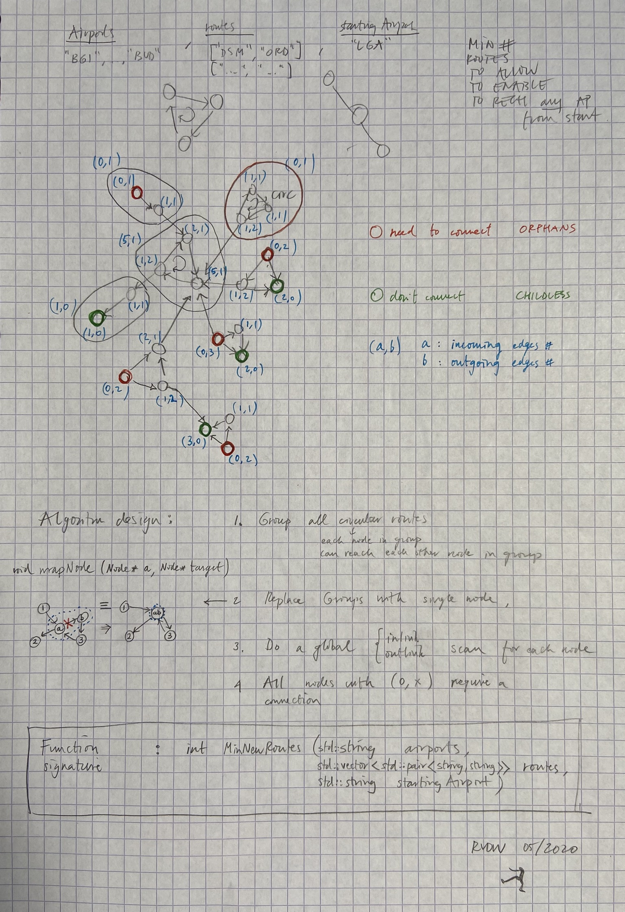

# ConnectionsGraph
Solving airport connections problem (https://leetcode.com/problems/redundant-connection-ii/) with my own custom graph class.

I used Kosaraju's algorithm to detect the strongly connected components.

